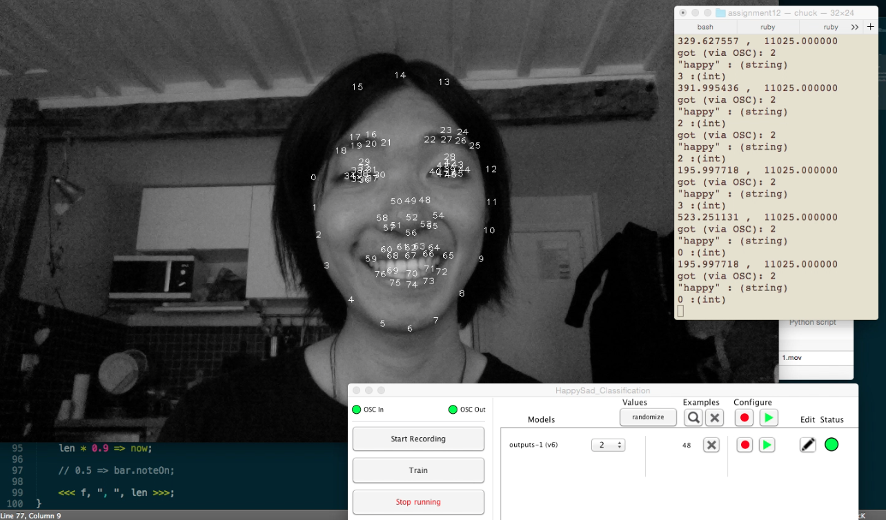

Brian Emo
=========
by David Su http://usdivad.com/

##Description:
Brian Emo is a personalized music soundtrack, algorithmically composed based on facial expression recognition / face detection. The program uses OpenCV + PyStasm to extract STASM landmarks from live webcam input; these landmarks are fed via PyOSC into Wekinator, which then outputs an emotion classification. A ChucK music generator listens for changes in emotion and updates musical parameters accordingly.

##Demo Video:
https://vimeo.com/167879128

##Inputs:
x and y coordinates of 77 facial landmarks, extracted from *face.py* using the OpenCV and PyStasm libraries.

##Outputs:
Music generated from *composer.ck*, which is updated according to Wekinator emotion classifications.

##Machine Learning Details:
The program uses the k-Nearest Neighbor (kNN) algorithm, with n = 3, in order to classify the facial input as "happy" or "sad". Tests were made with other algorithms, and support vector machines (SVMs) seemed especially promising due to the existing research highlighting their usage in facial expression recognition. However, kNN ended up yielding the best results with the given training examples; perhaps re-training, or extracting features beyond simply the x and y coordinates of the landmarks, would allow other machine learning algorithms to perform better.

##Challenges:
The most significant challenge encountered in this project was supplying adequate training data such that Wekinator could distinguish between the two emotion classifications with a reasonable degree of both precision and recall. Attempts were made to classify all seven "universal facial expressions of emotion" [1]. Due to time constraints, further feature extraction for the input data was not completed, although that is planned for future versions of the software.

----
[1] Ekman, Paul, et al. "Universals and cultural differences in the judgments of facial expressions of emotion." *Journal of personality and social psychology* 53.4 (1987): 712.

##Dependencies:
- Python 2.x https://www.python.org/downloads/
    - OpenCV http://opencv.org/downloads.html
    - PyOSC https://github.com/ptone/pyosc
    - PyStasm https://github.com/mjszczep/PyStasm
        - **NOTE:** This should come already built in this current repository, but if you run into errors you may want to recompile it from the link above.
        - If your C++ compiler doesn't support unordered maps, you should set `CACHE` to 0 in line 9 of *src/hatdesc.cpp*
- Wekinator http://www.wekinator.org/downloads/
- ChucK http://chuck.cs.princeton.edu/

##Usage Instructions:
1. Open *ASMToEmotion/HappySad\_Classification/HappySad\_Classification.wekproj* in Wekinator. Press "Run" and make sure it's listening on port 6448 and sending OSC messages to port 12000.
2. Run the input program: `python face.py`
3. In a separate thread, run the output program: `chuck composer.ck`